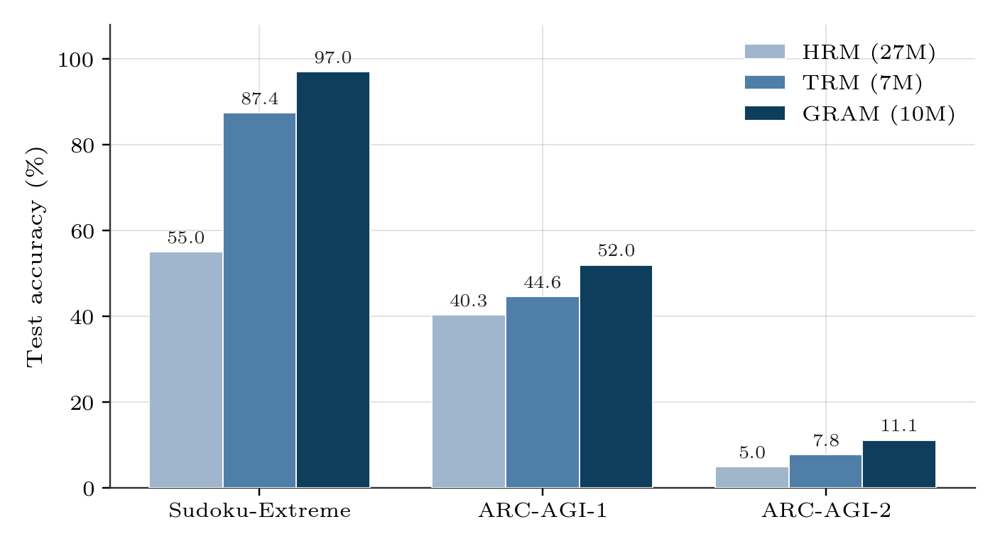

*Large language models externalize reasoning as chains of generated tokens, which ties computational depth to sequence length and to the availability of high-quality reasoning traces. A separate line of work instead refines a persistent latent state through repeated application of a small shared network, which decouples reasoning depth from both parameter count and output length. This note summarizes three models in that line: the Hierarchical Reasoning Model (HRM), which recurses two networks at different timescales under a fixed-point justification; the Tiny Recursion Model (TRM), which removes that justification and matches or exceeds HRM's generalization with a single two-layer network; and Generative Recursive reAsoning Models (GRAM), which recast the same recursion as a latent-variable generative process trained by amortized variational inference. This note reports the benchmark numbers each paper uses to argue its case, places the sequence of simplifications and generalizations in context, and discusses where the resulting training objectives converge with, and diverge from, denoising score matching and the other iterative-refinement machinery of diffusion models. The claim that survives across all three papers is that recursive test-time computation on a tiny network outperforms single-pass inference on much larger ones, on tasks that resist pattern-matching but reward search.*

## Introduction

Large language models increase their effective reasoning depth at inference time by generating longer chains of thought, a strategy that trades latency for accuracy and that depends on the availability of reasoning traces worth imitating.
Snell et al.'s work on [test-time compute scaling](https://arxiv.org/abs/2408.03314) shows that this token budget is itself a scaling axis distinct from parameter count, so that a smaller model given more inference-time compute can match a larger model given less.
The three models discussed in this note pursue the same idea through a different mechanism: instead of emitting tokens, each recurses a shared network over a fixed-size latent state, so that additional computation lengthens an internal trajectory rather than an output sequence.
This substitution removes two costs of chain-of-thought at once, namely the need for token-level supervision of intermediate steps and the risk that a single wrong token derails the rest of the generation.
It also raises the question this note is organized around: how much of the resulting machinery is a genuine alternative to the generative-modeling toolkit built around diffusion and score matching, and how much reproduces that toolkit under different names.

All three papers evaluate on the same small set of hard, low-data puzzle tasks, and the choice of tasks is itself informative about what the recursion is meant to buy.
[ARC-AGI](https://arxiv.org/abs/1911.01547) and its harder successor [ARC-AGI-2](https://arxiv.org/abs/2505.11831) pose few-shot grid-transformation problems that resist both memorization and standard pattern completion.
Sudoku-Extreme and Maze-Hard require constraint propagation or long-horizon pathfinding over a fixed grid, tasks on which a single feedforward pass, and even chain-of-thought-augmented large language models, generalize poorly.
Every model in this note trains on the order of one thousand examples per task, without pretraining and without chain-of-thought supervision, which means that any accuracy gain has to come from the inductive bias of the architecture rather than from data scale.
This shared regime is why parameter count and benchmark accuracy transfer meaningfully across the three papers, and it is why Figure 3 can later place them directly against large reasoning models on a single axis.

The next three sections follow the sequence in which the field actually moved.
The [HRM section](#hierarchical-convergence-the-hrm-baseline) describes HRM's hierarchical-convergence procedure and the fixed-point argument used to train it without full backpropagation through time.
The [TRM section](#tiny-recursion-removing-the-scaffolding) describes TRM, which keeps deep supervision but discards the fixed-point justification, the two-network hierarchy, and the biological framing, while improving generalization on every benchmark HRM reports.
The [GRAM section](#from-deterministic-to-generative-recursion-gram) describes GRAM, which reintroduces structure in a different place by turning the deterministic recursion into a stochastic latent-variable model trained with an evidence lower bound.
The [diffusion-connections section](#connections-to-iterative-refinement-in-diffusion-models) takes up the comparison to diffusion models directly, and the [closing discussion](#discussion-and-open-questions) covers the questions the three papers leave open.

## Hierarchical convergence: the HRM baseline

[HRM](https://arxiv.org/abs/2506.21734) performs sequential reasoning inside a single forward pass by recursing two small Transformer networks, \(f_L\) and \(f_H\), at different frequencies, rather than by unrolling one network over time.
The low-level network \(f_L\) updates a fast latent \(z_L\) several times for every one update that the high-level network \(f_H\) applies to a slow latent \(z_H\), a design the authors motivate by analogy to multi-timescale cortical processing.
Given \(n\) low-level steps per high-level cycle and \(T\) such cycles, one forward pass repeats

\[
z_L \leftarrow f_L(z_L + z_H + x), \qquad z_H \leftarrow f_H(z_L + z_H) \tag{1}
\]

with the first update applied \(n\) times before the second is applied once, and this pair of updates repeated for \(T\) cycles in total.
The authors call this procedure hierarchical convergence, since holding \(z_H\) fixed while \(z_L\) iterates lets the fast latent approach a local equilibrium before the slow latent is allowed to move at all.

Backpropagating through all \(nT\) steps of this recursion, repeated over \(N_\mathrm{sup}\) supervision steps described below, would require storing a computational graph equivalent to hundreds of stacked layers.
HRM avoids this cost by assuming that the recursion has converged to a fixed point,

\[
z_L^{*} \approx f_L(z_L^{*} + z_H + x), \qquad z_H^{*} \approx f_H(z_L + z_H^{*}) \tag{2}
\]

and invoking the implicit function theorem, in the one-step-gradient form used for [deep equilibrium models](https://arxiv.org/abs/1909.01377), to justify backpropagating through only the final \(f_L\) and \(f_H\) evaluation of the last cycle.
Every earlier evaluation is computed under `no_grad`, so that the memory cost of training is independent of \(n\) and \(T\) and depends only on the two networks' own depth.

Two further mechanisms complete HRM.
Deep supervision reuses the pair \((z_L,z_H)\) from one forward pass as the initialization for the next, detached from the computational graph, for up to \(N_\mathrm{sup}=16\) supervision steps, which lets the model refine its answer across steps the way a much deeper network would refine it across layers, at a fraction of the memory cost.
Adaptive computational time, trained with a Q-learning objective on an auxiliary head attached to \(z_H\), lets the model halt early on easy examples rather than spend all \(N_\mathrm{sup}\) steps on every input, at the cost of a second forward pass per optimization step to estimate the value of continuing.
With these three mechanisms combined, a 27M-parameter HRM trained on roughly 1,000 examples per task, without pretraining or chain-of-thought data, reaches 55.0% on Sudoku-Extreme and 40.3% on ARC-AGI-1, benchmarks on which token-based reasoning in much larger language models makes comparatively little headway.

This result comes with a caveat that motivates the next section directly.
An independent analysis by the ARC Prize Foundation, cited by Jolicoeur-Martineau, isolates how much of this gain is attributable to each mechanism: single-step supervision reaches 19% accuracy on their setup, deep supervision alone raises this to 39%, while adding the hierarchical recursion on top of deep supervision raises it only from 35.7% to 39.0%.
The fixed-point assumption underlying Equation (2) is similarly uncertain in practice, since the residual on \(z_L\) has not been shown to approach zero after only \(n=2\) evaluations, the setting used in every HRM experiment.
The [next section](#tiny-recursion-removing-the-scaffolding) follows this observation to its conclusion, asking how much of HRM's architecture is load-bearing once these two assumptions are examined directly.

## Tiny recursion: removing the scaffolding

[TRM](https://arxiv.org/abs/2510.04871) answers that question by replacing HRM's two networks with a single two-layer network \(f_\theta\) and re-deriving the recursion around two variables with concrete roles: a current answer \(y\), decoded directly by an output head, and a latent reasoning register \(z\), which carries information between steps without corresponding to a solution on its own.
This reinterpretation follows directly from inspecting HRM's own latents, since reverse-embedding and arg-max-decoding \(z_H\) reproduces the model's current solution while the same operation on \(z_L\) does not, which is exactly the asymmetry TRM's \(y\) and \(z\) make explicit rather than attributing to biology.
One recursion process, using a single network for both roles, is

\[
z \leftarrow f_\theta(x, y, z) \quad \text{(repeated n times)}, \qquad y \leftarrow f_\theta(y, z) \quad \text{(once)} \tag{3}
\]

and this process is itself repeated for \(T\) cycles, exactly as in HRM, before the answer head reads out \(\hat y = \arg\max f_O(y)\).

The change that matters most is what happens to the gradient.
Rather than invoking the implicit function theorem to justify a one-step approximation, TRM simply backpropagates through the full \(T\)-cycle recursion in Equation (3), since with \(n=6\) and \(T=3\) this recursion is short enough, at 21 network evaluations, that full backpropagation is affordable on a network with only two layers.
This single change accounts for the largest jump in Jolicoeur-Martineau's ablation table: on Sudoku-Extreme, reverting to a one-step gradient approximation while holding everything else fixed drops accuracy from 87.4% to 56.5%, a larger effect than any other design choice reported for TRM.
Table 1 reports the remaining ablations at matched effective depth, and each of them is consistent with the same lesson, namely that mechanisms justified by an external theory (a fixed point, a biological hierarchy) tend to matter less than mechanisms that reduce overfitting or shorten the credit-assignment path on a data-scarce task.

**Table 1.** Ablation of TRM on Sudoku-Extreme, with each row changing one component of the full configuration while holding the rest fixed. Depth is the effective computational depth \(T(n+1)n_\mathrm{layers}\) per supervision step. Values are as reported by Jolicoeur-Martineau.

| Configuration | Accuracy (%) | Depth | Fwd. passes | Params |
|---|---|---|---|---|
| HRM | 55.0 | 24 | 2 | 27M |
| TRM (\(T=3, n=6\)) | **87.4** | 42 | 1 | 5M |
| – w/ adaptive computation time | 86.1 | 42 | 2 | 5M |
| – w/ separate \(f_H, f_L\) networks | 82.4 | 42 | 1 | 10M |
| – w/o exponential moving average | 79.9 | 42 | 1 | 5M |
| – w/ 4 layers, \(n=3\) | 79.5 | 48 | 1 | 10M |
| – w/ self-attention token mixing | 74.7 | 42 | 1 | 7M |
| – w/ \(T=2, n=2\) | 73.7 | 12 | 1 | 5M |
| – w/ one-step gradient approximation | 56.5 | 42 | 1 | 5M |

Two of these ablations are worth stating explicitly rather than leaving to the table.
Replacing the two separate networks \(f_H,f_L\) with one shared network improves accuracy from 82.4% to 87.4% while halving the parameter count, which means the hierarchy is not merely unnecessary but actively costly relative to a single network doing both jobs in sequence.
Similarly, an attention-free multilayer perceptron across the sequence dimension, in the style of the MLP-Mixer, outperforms self-attention on Sudoku's fixed 81-token grid, although TRM retains self-attention for ARC-AGI and Maze-Hard, since their larger and variable-size contexts do not share Sudoku's fixed short length.
With these changes, TRM improves the state of the art from 55% to 87% on Sudoku-Extreme, from 75% to 85% on Maze-Hard, from 40% to 45% on ARC-AGI-1, and from 5% to 8% on ARC-AGI-2, using a network with roughly one-quarter of HRM's parameter count.
Every one of these numbers, however, is still produced by a single deterministic trajectory: given the same input and the same initialization, TRM, like HRM, always converges to the same \(y\), which is exactly the property the [next section](#from-deterministic-to-generative-recursion-gram) sets out to change.

## From deterministic to generative recursion: GRAM

A deterministic recursion collapses the space of reasoning paths onto a single attractor, which is unproblematic when a task has one correct answer but becomes a structural limitation when it does not.
Baek et al. make this concrete with N-Queens and graph-coloring instances constructed to admit many valid completions: at matched parameter count, HRM and TRM recover at most 36.1% of the valid solutions to a given instance, because a single trajectory can express only one of them regardless of how it is trained.
[Generative Recursive reAsoning Models (GRAM)](https://arxiv.org/abs/2605.19376) address this by turning the deterministic update into a stochastic one, so that repeated computation defines a distribution over latent trajectories instead of a single path.
Figure 1 places this change inside the same recursive template used by HRM and TRM, retaining their fast-slow latent split while sampling the slow component instead of computing it directly.

**Figure 1.** The recursive template shared by HRM, TRM, and GRAM, drawn in TRM's \((y,z)\) notation. HRM's \((z_H,z_L)\) correspond to \((y,z)\) under the reinterpretation of the [previous section](#tiny-recursion-removing-the-scaffolding). GRAM (orange) replaces the deterministic slow-state update with a learned Gaussian perturbation of a deterministic proposal; HRM and TRM omit this box entirely.

Concretely, GRAM computes a deterministic proposal \(u_t\) exactly as HRM or TRM would, then samples a state-dependent Gaussian perturbation around it,

\[
u_t = f_\theta(z_{t-1}, x), \qquad \epsilon_t \sim \mathcal{N}\big(\mu_\theta(u_t), \sigma_\theta^2(u_t)\, I\big), \qquad z_t = u_t + \epsilon_t \tag{4}
\]

a quantity the authors call learnable stochastic guidance, with \(\mu_\theta\) steering the trajectory and \(\sigma_\theta\) controlling how much it explores around that steering signal.
In the hierarchical instantiation that GRAM in fact uses, this perturbation is added only to the slow (high-level) state, while the fast (low-level) state is still refined deterministically \(K\) times per transition, so that stochasticity enters exactly where HRM's own biological framing placed the slower, more abstract component of the two latents.

Training treats the resulting trajectory as a latent variable in a generative model of \(y\) given \(x\), optimized through the evidence lower bound

\[
\log p_\theta(y \mid x) \;\ge\; \mathbb{E}_{q_\phi(\tau \mid x, y)}\big[\log p_\theta(y \mid \tau, x)\big] \;-\; \mathrm{KL}\big(q_\phi(\tau \mid x, y) \,\|\, p_\theta(\tau \mid x)\big) \tag{5}
\]

with a learned prior \(p_\theta\) over trajectories \(\tau\) and an amortized posterior \(q_\phi\) that additionally sees the target \(y\) during training.
As in HRM and TRM, backpropagating through the entire trajectory is not attempted; GRAM instead propagates gradients only through the final transition of each supervision step, a truncation the authors justify by the same precedent used in earlier sequential latent-variable models such as VRNN and stochastic-recurrent networks, rather than by an implicit-function-theorem argument.
The parallel to the [TRM section](#tiny-recursion-removing-the-scaffolding) is worth naming directly: HRM truncated the gradient because it assumed convergence to a fixed point, TRM removed that truncation because the recursion was short enough to afford full backpropagation, and GRAM reintroduces a truncation of its own, but motivated by memory cost alone rather than by any claim about convergence.

On the benchmarks introduced [above](#introduction), this generative reformulation outperforms both deterministic baselines at every task, using a parameter count between HRM's and TRM's own.
At matched supervision depth, GRAM reaches 97.0% on Sudoku-Extreme, 52.0% on ARC-AGI-1, and 11.1% on ARC-AGI-2 with 10M parameters, against TRM's 87.4%, 44.6%, and 7.8% at 7M parameters[^1] and HRM's 55.0%, 40.3%, and 5.0% at 27M parameters, as summarized in Figure 2.
Because each sampled trajectory is an independent draw from \(p_\theta(\tau \mid x)\), GRAM additionally scales at inference by sampling \(N\) trajectories in parallel and selecting among them by majority vote or by a learned value head, so that \(N=20\) parallel samples at 16 recursive iterations outperforms every deterministic baseline run out to 320 iterations on Sudoku-Extreme, 97.0% against TRM's 90.5%, at a comparable computational budget.
This width axis has no deterministic analogue, since a single fixed trajectory has nothing to sample: it is available to GRAM specifically because the recursion became a distribution rather than a point estimate.

[^1]: Jolicoeur-Martineau's own ablation (Table 1 above) reports 5M parameters for this exact configuration; Baek et al.'s reproduction reports 7M for the same architecture and the same accuracy numbers. The discrepancy is between the two papers' own counts, not between two different models; this note reports each source's figure in its own context rather than adjudicating between them.

**Figure 2.** Test accuracy of HRM, TRM, and GRAM on the three puzzle benchmarks used across all three papers, at matched 16-step supervision depth. Values from Baek et al., Table 8, who reproduce HRM and TRM under identical conditions to GRAM.

Figure 3 places these three models against large reasoning models reported in the same table, on the harder ARC-AGI-2 benchmark.
Two comparisons are load-bearing here rather than merely illustrative.
First, a direct-prediction network with exactly HRM's 27M parameters and no recursion scores 0.0%, which isolates recursive computation, rather than parameter count, as the source of HRM's nonzero accuracy.
Second, Deepseek-R1 at 671B parameters and Grok-4-thinking at 1.7T parameters score 1.3% and 16.0% respectively, so that GRAM's 11.1% at 10M parameters sits inside the range spanned by reasoning models four to five orders of magnitude larger, on a benchmark designed specifically to resist the kind of pattern completion those larger models rely on.
None of this implies that recursive test-time computation subsumes parameter scaling in general, since Gemini 3 Pro reaches 31.1% on the same benchmark and remains the strongest system reported, but it does mean that the two axes are not redundant with each other on tasks of this kind.

**Figure 3.** Parameter count against ARC-AGI-2 accuracy for the recursive-reasoning lineage and for large reasoning models evaluated in the same paper. Direct Pred shares HRM's parameter budget without any recursion. Values from Baek et al., Table 8; Claude 3.7, o3-mini-high, GPT-5.2, and Gemini 3 Pro are omitted because their parameter counts are undisclosed.

## Connections to iterative refinement in diffusion models

GRAM is not the only mid-2026 attempt to make TRM's recursion stochastic.
The [Probabilistic Tiny Recursive Model](https://arxiv.org/abs/2605.19943) injects Gaussian noise directly into TRM's existing deep-supervision loop and selects among the resulting trajectories with TRM's own halting head, raising Sudoku-Extreme accuracy from 87.4% to 98.75% without retraining the underlying network.
That two groups converged on stochastic recursion within roughly the same month, from a test-time perturbation on one side and a full variational reformulation on the other, is itself evidence that determinism, rather than any specific benchmark number, was the limiting property of the TRM-HRM lineage.
It also motivates the comparison this section makes precise: how much of GRAM's machinery is diffusion under a different name, and where exactly does the analogy break.

The comparison is closest, and most informative, at the level of a single update.
A variance-preserving diffusion step and GRAM's slow-state update both add reparameterized Gaussian noise to a running state,

\[
x_t = \sqrt{1-\beta_t}\,x_{t-1} + \sqrt{\beta_t}\,\epsilon_t \quad \text{(diffusion)}, \qquad\qquad y_t = u_t + \epsilon_t \quad \text{(GRAM, Eq. 4)} \tag{6}
\]

with \(\epsilon_t \sim \mathcal{N}(0,I)\) on the left and \(\epsilon_t \sim \mathcal{N}(\mu_\theta(u_t),\sigma_\theta^2(u_t))\) on the right.
The difference in that last clause is the whole disanalogy: \(\beta_t\) is a fixed, hand-chosen schedule applied to the raw signal \(x_{t-1}\), whereas \(\mu_\theta\) and \(\sigma_\theta\) are learned functions of a network's own proposal \(u_t\), jointly trained with the decoder rather than fixed in advance.
A diffusion model therefore learns only the reverse of a known forward corruption, while GRAM learns both directions of a process that has no predetermined forward half to invert, which places it structurally closer to a sequential latent-variable model such as a variational recurrent network than to a score-based generative model, notwithstanding the update rules' surface resemblance.

This distinction is not a technicality, since it determines which closed-form tools transfer and which do not.
[Tweedie's formula](https://efron.ckirby.su.domains/papers/2011TweediesFormula.pdf) gives the posterior mean of a clean signal given a noisy observation in closed form, precisely because the corruption kernel \(p(x_t \mid x_0)\) is fixed and known by construction; [denoising score matching](https://doi.org/10.1162/NECO_a_00142) then trains a network to approximate the score of that same fixed kernel at every noise level.
Neither construction has a direct counterpart in GRAM, because \(p_\theta(z_t \mid z_{t-1})\) is learned rather than fixed, and there is no intermediate "clean" state that a closed-form estimator could target.
The closest structural analogue is GRAM's own Latent Process Reward Model, a value head trained by regression against terminal task accuracy rather than derived from any score function, which stands in for a denoiser without inheriting the guarantees that make a denoiser useful in the diffusion setting.
Where the two settings do align without qualification is in the practical role of iteration count: GRAM's own ablation shows generation quality on binarized MNIST improving monotonically from an Inception Score of 1.85 at 8 steps to 2.04 at 256 steps, despite training with only 16, exactly the pattern by which additional reverse-diffusion steps trade compute for sample fidelity at a fixed trained model.

One further parallel is worth flagging precisely because it does not hold, and the [TRM section](#tiny-recursion-removing-the-scaffolding) already contains the counter-example.
Diffusion training decomposes an otherwise fully coupled reverse chain into independent per-noise-level regression problems, which is what makes training tractable at hundreds of steps; HRM's one-step gradient approximation and GRAM's final-transition-only backpropagation are both truncations in the same spirit, trading gradient bias for bounded memory.
TRM's ablation in Table 1 shows this trade going the other way: at only 21 evaluations, the recursion is short enough that full backpropagation is affordable outright, and imposing a truncation designed for much longer chains costs 31 points of accuracy rather than saving anything.
The lesson generalizes beyond this specific architecture: a truncation technique's value depends on the length of the chain it is applied to, and importing it because an adjacent literature relies on it, rather than because the chain in front of you actually needs it, is a mistake independent of which literature the technique came from.

## Discussion and open questions

The throughline across HRM, TRM, and GRAM is a progressive separation of what the recursion is for from how the recursion is justified.
HRM bundled recursive computation with a specific hierarchy and a specific convergence argument; TRM kept the computation and discarded both the hierarchy and the argument, with the ablations in the [TRM section](#tiny-recursion-removing-the-scaffolding) showing that almost none of the discarded material had been doing useful work; GRAM then added back a different kind of structure, stochasticity with a variational objective, motivated not by biology or by convergence but by a concrete failure mode, mode collapse on inputs with more than one valid answer.
Each step is a simplification followed by a re-complication in a different place, and nothing in the sequence suggests it has ended.

What remains genuinely open is what the intermediate variables represent.
A [mechanistic analysis by Ren and Liu](https://arxiv.org/abs/2601.10679) asks directly whether hierarchical reasoning models of this kind reason or merely guess, which is exactly the question TRM's own answer/reasoning-register split invites but does not settle by construction alone.
A [separate reinterpretation](https://arxiv.org/abs/2511.16886) casts the asymmetry between TRM's \(y\) and \(z\) in control-theoretic terms, arguing that only \(y\) is decoded and penalized and so is pushed toward the space of valid answers, while \(z\) is left free to specialize into whatever intermediate computation makes that possible, a description compatible with, but not identical to, TRM's own framing of \(z\) as a reasoning register.
Both readings agree that the two-variable split is doing real work; they do not yet agree on the right vocabulary for describing what that work is.

A last limitation is worth stating as a consequence of the architecture rather than as an incidental gap.
Deep supervision buys sample efficiency by detaching the computational graph between supervision steps, which is exactly the mechanism that keeps a 5-to-10M-parameter network trainable on a thousand examples; the same detachment removes the across-depth parallelism that makes Transformer pretraining cheap at the scale frontier language models are trained at.
GRAM's own authors note this directly, citing the sequential nature of deep supervision as the barrier to scaling their approach toward larger foundation models.
This is not a defect to be engineered away without cost: it is the same trade-off, sample efficiency against parallel trainability, that separates a 7M-parameter network solving Sudoku-Extreme from a language model solving almost nothing on the same benchmark, and any future model in this line will have to choose a point on that trade-off rather than escape it.

## References

- Guan Wang, Jin Li, Yuhao Sun, Xing Chen, Changling Liu, Yue Wu, Meng Lu, Sen Song, and Yasin Abbasi Yadkori. [Hierarchical Reasoning Model](https://arxiv.org/abs/2506.21734). arXiv:2506.21734, 2025.
- Alexia Jolicoeur-Martineau. [Less is More: Recursive Reasoning with Tiny Networks](https://arxiv.org/abs/2510.04871). arXiv:2510.04871, 2025.
- Junyeob Baek, Mingyu Jo, Minsu Kim, Mengye Ren, Yoshua Bengio, and Sungjin Ahn. [Generative Recursive Reasoning](https://arxiv.org/abs/2605.19376). arXiv:2605.19376, 2026.
- Charlie Snell, Jaehoon Lee, Kelvin Xu, and Aviral Kumar. [Scaling LLM Test-Time Compute Optimally Can Be More Effective Than Scaling Model Parameters](https://arxiv.org/abs/2408.03314). arXiv:2408.03314, 2024.
- François Chollet. [On the Measure of Intelligence](https://arxiv.org/abs/1911.01547). arXiv:1911.01547, 2019.
- François Chollet, Mike Knoop, Gregory Kamradt, Bryan Landers, and Henry Pinkard. [ARC-AGI-2: A New Challenge for Frontier AI Reasoning Systems](https://arxiv.org/abs/2505.11831). arXiv:2505.11831, 2025.
- Amin Sghaier et al. [Probabilistic Tiny Recursive Model](https://arxiv.org/abs/2605.19943). arXiv:2605.19943, 2026.
- Zirui Ren and Ziming Liu. [Are Your Reasoning Models Reasoning or Guessing? A Mechanistic Analysis of Hierarchical Reasoning Models](https://arxiv.org/abs/2601.10679). arXiv:2601.10679, 2026.
- [Latent Reasoning in TRMs Is Secretly a Policy Improvement Operator](https://arxiv.org/abs/2511.16886). arXiv:2511.16886, 2025.
- Shaojie Bai, J. Zico Kolter, and Vladlen Koltun. [Deep Equilibrium Models](https://arxiv.org/abs/1909.01377). NeurIPS, 2019.
- Bradley Efron. [Tweedie's Formula and Selection Bias](https://efron.ckirby.su.domains/papers/2011TweediesFormula.pdf). Journal of the American Statistical Association, 106(496), 2011.
- Pascal Vincent. [A Connection Between Score Matching and Denoising Autoencoders](https://doi.org/10.1162/NECO_a_00142). Neural Computation, 23(7), 2011.
